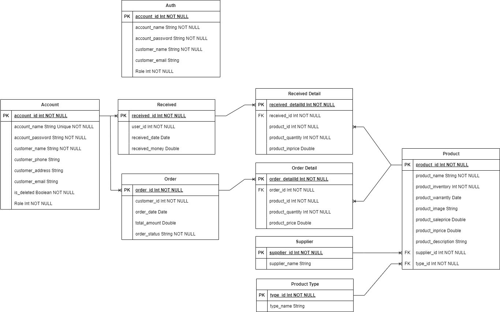

# README - Hệ Thống Quản Lý

## Mô hình cơ sở dữ liệu

Dưới đây là mô hình cơ sở dữ liệu cho hệ thống quản lý:

## 1. Bảng Auth
**Mục đích:** Quản lý thông tin xác thực người dùng.

### Trường:
- `account_id` (PK, int): Định danh tài khoản.
- `account_name` (String, Unique): Tên đăng nhập.
- `account_password` (String): Mật khẩu.
- `customer_name` (String): Tên khách hàng.
- `customer_email` (String): Email khách hàng.
- `role` (int): Vai trò người dùng (1 - Admin, 2 - User).

---

## 2. Bảng Account
**Mục đích:** Lưu trữ thông tin chi tiết tài khoản và khách hàng.

### Trường:
- `account_id` (PK, int): Định danh tài khoản (liên kết với Auth).
- `account_name` (String, Unique): Tên đăng nhập.
- `account_password` (String): Mật khẩu.
- `customer_name` (String): Tên khách hàng.
- `customer_phone` (String): Số điện thoại.
- `customer_address` (String): Địa chỉ.
- `customer_email` (String): Email.
- `is_selected` (Boolean): Trạng thái kích hoạt.
- `role` (int): Vai trò người dùng.

---

## 3. Bảng Received
**Mục đích:** Quản lý thông tin nhập hàng từ nhà cung cấp.

### Trường:
- `received_id` (PK, int): Định danh phiếu nhập.
- `user_id` (int, FK → Supplier.supplier_id): Nhà cung cấp.
- `received_date` (Date): Ngày nhập hàng.
- `received_money` (Double): Tổng tiền nhập hàng.

---

## 4. Bảng Order
**Mục đích:** Quản lý đơn hàng.

### Trường:
- `order_id` (PK, int): Định danh đơn hàng.
- `customer_id` (int, FK → Account.account_id): Khách hàng đặt hàng.
- `order_date` (Date): Ngày đặt hàng.
- `total_amount` (Double): Tổng tiền đơn hàng.
- `order_status` (String): Trạng thái (ví dụ: "Đang xử lý", "Hoàn thành").

---

## 5. Bảng Received Detail
**Mục đích:** Chi tiết sản phẩm trong phiếu nhập hàng.

### Trường:
- `received_detail_id` (PK, int): Định danh chi tiết.
- `order_id` (int, FK → Received.received_id): Liên kết với phiếu nhập.
- `product_id` (int, FK → Product.product_id): Sản phẩm.
- `product_quantity` (int): Số lượng nhập.
- `product_price` (Double): Giá nhập.

---

## 6. Bảng Order Detail
**Mục đích:** Chi tiết các sản phẩm trong đơn hàng.

### Trường:
- `order_detail_id` (PK, int): Định danh chi tiết.
- `order_id` (int, FK → Order.order_id): Liên kết với đơn hàng.
- `product_id` (int, FK → Product.product_id): Sản phẩm.
- `product_quantity` (int): Số lượng.
- `product_price` (Double): Giá sản phẩm.

---

## 7. Bảng Supplier
**Mục đích:** Quản lý nhà cung cấp.

### Trường:
- `supplier_id` (PK, int): Định danh nhà cung cấp.
- `supplier_name` (String): Tên nhà cung cấp.

---

## 8. Bảng Product Type
**Mục đích:** Phân loại sản phẩm.

### Trường:
- `type_id` (PK, int): Định danh loại sản phẩm.
- `type_name` (String): Tên loại (ví dụ: "Điện tử", "Gia dụng").

---

## 9. Bảng Product
**Mục đích:** Lưu trữ thông tin sản phẩm.

### Trường:
- `product_id` (PK, int): Định danh sản phẩm.
- `product_name` (String): Tên sản phẩm.
- `product_inventory` (int): Tồn kho.
- `product_warranty` (Date): Ngày hết hạn bảo hành.
- `product_image` (String): Đường dẫn ảnh.
- `product_saleprice` (Double): Giá bán hiện tại.
- `product_ipprice` (Double): Giá nhập hiện tại.
- `product_description` (String): Mô tả.
- `supplier_id` (int, FK → Supplier.supplier_id): Nhà cung cấp.
- `type_id` (int, FK → Product Type.type_id): Loại sản phẩm.

