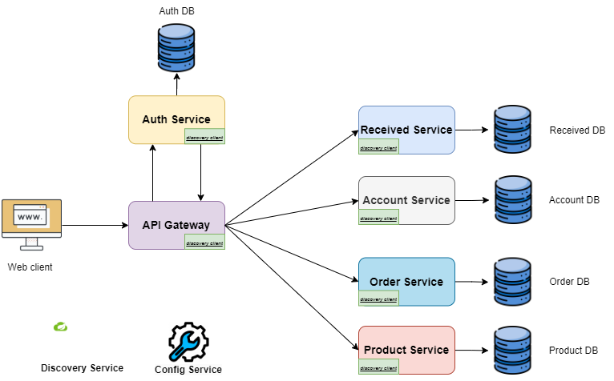

# Hệ thống Microservice - Tài liệu README

## Tổng quan  
Hệ thống được xây dựng theo kiến trúc microservice, bao gồm các dịch vụ độc lập quản lý từng nghiệp vụ cụ thể. Mỗi dịch vụ sở hữu cơ sở dữ liệu riêng và giao tiếp qua API hoặc message broker.  

---

## Danh sách dịch vụ  

### **1. Auth Service**  
**Mục đích**: Quản lý xác thực người dùng (đăng nhập, phân quyền).  
**Cơ sở dữ liệu**: `Auth DB` (Bảng `Auth`).  
**Chức năng chính**:  
- Xác thực thông tin đăng nhập (`account_name`, `account_password`).  
- Phân quyền dựa trên trường `Role`.  
- Cấp và quản lý token (JWT/OAuth).  

---

### **2. Account Service**  
**Mục đích**: Quản lý thông tin tài khoản và khách hàng.  
**Cơ sở dữ liệu**: `Account DB` (Bảng `Account`).  
**Chức năng chính**:  
- Cập nhật thông tin cá nhân (`customer_name`, `customer_phone`, `customer_address`).  
- Quản lý trạng thái tài khoản (`is_selected`).  

---

### **3. Order Service**  
**Mục đích**: Xử lý nghiệp vụ đặt hàng.  
**Cơ sở dữ liệu**: `Order DB` (Bảng `Order` và `Order Detail`).  
**Chức năng chính**:  
- Tạo và hủy đơn hàng.  
- Tính toán `total_amount` dựa trên `product_quantity` và `product_saleprice` (lấy từ Product Service).  
- Cập nhật trạng thái đơn hàng (`order_status`).  

---

### **4. Product Service**  
**Mục đích**: Quản lý thông tin sản phẩm và tồn kho.  
**Cơ sở dữ liệu**: `Product DB` (Bảng `Product`, `Supplier`, `Product Type`).  
**Chức năng chính**:  
- Cập nhật giá bán (`product_saleprice`) và giá nhập (`product_inprice`).  
- Quản lý tồn kho (`product_inventory`).  
- Liên kết với nhà cung cấp (`supplier_id`) và phân loại sản phẩm (`type_id`).  

---

### **5. Received Service**  
**Mục đích**: Quản lý quá trình nhập hàng từ nhà cung cấp.  
**Cơ sở dữ liệu**: `Received DB` (Bảng `Phiếu nhập hàng` và `Chi tiết phiếu nhập`).  
**Chức năng chính**:  
- Tạo phiếu nhập hàng và cập nhật tồn kho trong Product Service.  
- Tính toán `tong_tien_nhap` dựa trên `so_luong_nhap` và `gia_nhap` (tham chiếu từ Product Service).  

---

### **6. Discovery Service**  
**Mục đích**: Đăng ký và phát hiện các dịch vụ trong hệ thống.  
**Công nghệ**: Netflix Eureka.  
**Chức năng chính**:  
- Quản lý danh sách các service instances.  
- Hỗ trợ cân bằng tải (load balancing).  

---

### **7. Config Service**  
**Mục đích**: Quản lý cấu hình tập trung cho toàn hệ thống.  
**Công nghệ**: Spring Cloud Config.  
**Chức năng chính**:  
- Lưu trữ cấu hình (database URL, API key, logging level).  
- Cập nhật cấu hình động mà không cần khởi động lại dịch vụ.  